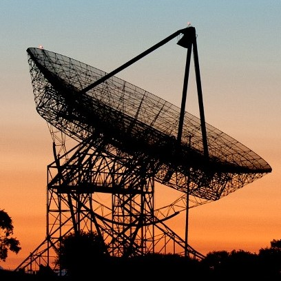

# DSNbot

a discord bot for a 17776-20020 fan server.

add to server: 

https://discordapp.com/oauth2/authorize?client_id=762139991534469150&permissions=523328&scope=bot

## Functionality

### Currently Implemented:
- alerts for 20020 updates (done, but will be updated for 20021)
- alerts for new articles by jon on SBNATION
- alerts for new fanfics posted in the AO3 17776 tag
- control over an aternos minecraft server (restricted)
- ask what DSN is talking to right now by scraping https://eyes.nasa.gov/dsn/dsn.html
- add custom RSS feeds to update in certain channels. checked every 15 minutes
- add currently-implemented custom feed updates as scheduled tasks in any channel. (read how to contribute to add your own)

### Panned Capabilities:
- Integrate Twitter API for jon, scoragami, NFL tweets updates

## Contribution

If you are a member of the server reading this and youre saying "hey i want to help!" then
just DM me (starmaid) with your github username or email and I can add you as a collaborator! 
Once theres more than just me on this project, ill protect the main branch - you will have to be familiar with github if you arent already, so keep that in mind (not difficult, but will take a minute. definitely worth it though).

If you dont want to code but see an issue or have a suggestion, feel free to open an issue for 
bug tracking :) or of course we can talk in #programming